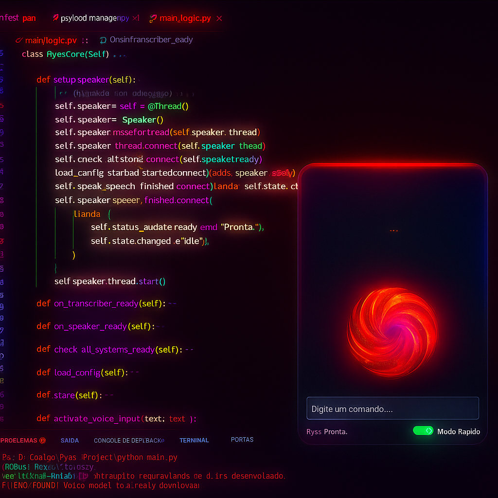

# 🔴 Ryas — Local AI Assistant

<div align="center">



*Um assistente de IA desktop que roda 100% offline — sem nuvem, sem rastreamento, sem limites.*


</div>

---

## 🚀 Sobre o Projeto

O **Ryas** nasceu de uma necessidade real: ter um assistente inteligente que não dependesse de nuvem, garantindo **privacidade total dos dados** e **baixa latência**. Diferente de wrappers simples de API, o Ryas gerencia o ciclo de vida completo do modelo localmente — do carregamento à inferência.

Além de ser um assistente conversacional, o Ryas conta com um **módulo de Cibersegurança Proativa** que monitora a rede em tempo real, detectando dispositivos não autorizados e comportamentos suspeitos.

> *"Seu assistente. Sua máquina. Seus dados."*

---

## ✨ Funcionalidades

| Módulo | Descrição | Status |
|--------|-----------|--------|
| 💬 Chat com IA | Conversação local via Ollama + Llama3 | ✅ Funcionando |
| 🎤 Voz → Texto | Transcrição de áudio com Faster-Whisper | ✅ Funcionando |
| 🔊 Texto → Voz | Síntese de voz com Coqui TTS | ✅ Funcionando |
| 🛡️ Byakugan (Scan) | Scan de rede e detecção de intrusos | ✅ Funcionando |
| ⚡ Modo Rápido | Respostas otimizadas para baixa latência | ✅ Funcionando |
| 📦 Build .exe | Empacotamento com PyInstaller | 🔄 Em progresso |

---

## 🛠️ Stack Tecnológica

```
Core
├── Python 3.x
├── PySide6          → Interface gráfica (GUI)
└── QThreads         → Concorrência e operações assíncronas

Inteligência Artificial
├── Ollama           → Gerenciamento local de modelos LLM
├── Llama3 (GGUF)   → Modelo principal (quantizado 4-bit)
├── Faster-Whisper   → Reconhecimento de fala (STT)
└── Coqui TTS        → Síntese de voz (TTS)

Segurança
└── Byakugan         → Scanner de rede + detecção de intrusos
```

---

## 💡 Desafios Técnicos Superados

**🔧 Dependency Hell**
Implementação de ambientes virtuais estritos e congelamento de versões via `requirements.txt` para garantir reprodutibilidade em diferentes máquinas.

**⚡ Otimização de Hardware**
Uso de modelos quantizados (GGUF 4-bit) para rodar inferência em hardware de consumo — CPUs comuns sem GPU dedicada — sem estourar a RAM.

**🎯 Latência**
Ajuste fino de parâmetros de geração (`temperatura`, `top_k`, `top_p`) para equilibrar qualidade de resposta e velocidade.

**🧵 Interface Responsiva**
Uso de `QThreads` para isolar operações pesadas de IA do thread principal da GUI, eliminando travamentos na interface.

**🛡️ Segurança Local**
Módulo Byakugan realiza scan de rede em background, identificando dispositivos conectados e alertando sobre possíveis intrusos — tudo sem enviar dados para servidores externos.

---

## 📋 Pré-requisitos

- Windows 10/11
- Python 3.10+
- [Ollama](https://ollama.ai) instalado e rodando
- Modelo Llama3 baixado: `ollama pull llama3`
- Mínimo 8GB RAM (16GB recomendado)

---

## 📦 Como Rodar

```bash
# 1. Clone o repositório
git clone https://github.com/Kanashinho/RyasProject.git
cd RyasProject

# 2. Crie um ambiente virtual
python -m venv venv
venv\Scripts\activate

# 3. Instale as dependências
pip install -r requirements.txt

# 4. Configure as variáveis de ambiente
cp .env.example .env
# Edite o .env com suas configurações

# 5. Certifique-se que o Ollama está rodando
ollama serve

# 6. Execute o Ryas
python main.py
```

---

## ⚙️ Configuração (.env)

Copie o arquivo `.env.example` para `.env` e ajuste conforme sua máquina:

```env
# Modelo de IA
OLLAMA_MODEL=llama3
OLLAMA_HOST=http://localhost:11434

# Configurações de voz (opcional)
TTS_ENABLED=true
STT_ENABLED=true

# Segurança
NETWORK_SCAN_ENABLED=true
SCAN_INTERVAL=60
```

---

## 🗂️ Estrutura do Projeto

```
RyasProject/
├── main.py              # Ponto de entrada
├── main_logic.py        # Core do assistente (RyasCore)
├── requirements.txt     # Dependências
├── .env.example         # Template de configuração
├── .gitignore
│
├── ui/                  # Interface PySide6
├── modules/
│   ├── speaker.py       # Síntese de voz (Coqui TTS)
│   ├── transcriber.py   # Reconhecimento de fala (Faster-Whisper)
│   └── byakugan.py      # Módulo de scan de rede
└── config/              # Configurações e constantes
```

---

## 🗺️ Roadmap

- [x] Interface gráfica funcional com PySide6
- [x] Integração com Ollama + Llama3
- [x] Síntese e reconhecimento de voz
- [x] Módulo Byakugan (scan de rede)
- [x] Modo Rápido
- [ ] Build executável (.exe) via PyInstaller
- [ ] Modo serverbase (sem GUI, monitoramento 24/7)
- [ ] Suporte a múltiplos modelos simultâneos
- [ ] Plugin system para extensões

---

## 📄 Licença

Este projeto está licenciado sob a **MIT License** — veja o arquivo [LICENSE](LICENSE) para detalhes.

Você pode usar, copiar e modificar livremente, **desde que mantenha os créditos ao autor original**.

---

## 👤 Autor

**Kauã M. S. Winter Moraes**
- LinkedIn: [linkedin.com/in/kaua-winter](https://linkedin.com/in/kaua-winter)
- GitHub: [@Kanashinho](https://github.com/Kanashinho)
- Email: kaua.wintermoraes@gmail.com

---

<div align="center">
<i>Se este projeto foi útil para você, considere deixar uma ⭐</i>
</div>
